# 1. Introduction

This document compares parser A (BEFORE) with parser C (AFTER) for DONE sentences. It contains every improvement, regression, and persistent structural case recorded in the transition TSV. Improvement and regression sections show both parser trees; the persistent section shows the gold reference together with both parser trees. All trees are provided in LISP and graphical formats for human inspection.

**DONE improvements:** 9.  
**DONE regressions:** 3.  
**DONE persistent structural cases:** 11.  
**Total DONE cases documented:** 23.

# 2. DONE improvements

<div style="page-break-before: always;"></div>

### hil-data,0.8

| Field | Value |
|---|---|
| Dataset | hil-data |
| Status | DONE |
| Text | NiGijo liwenigi libinienigi |
| Portuguese | Aquela comida dela é bonita . |
| A result | STRUCTURAL_DIFFERENCE |
| C result | EXACT_MATCH |

#### BEFORE — parser A — LISP

```lisp
(
  (IP-MAT
    (NP
      (D NiGijo)
      (N$ liwenigi)
      (NP
        (N$ libinienigi))))
  (ID hil-data,0.8))
```

#### BEFORE — parser A — graphical tree


#### AFTER — parser C — LISP

```lisp
(
  (IP-MAT
    (NP-SBJ
      (D NiGijo)
      (N$ liwenigi))
    (NP-PRD
      (N$ libinienigi)))
  (ID hil-data,0.8))
```

#### AFTER — parser C — graphical tree

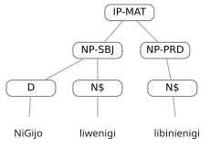

<div style="page-break-before: always;"></div>

### ped-gramm,0.12

| Field | Value |
|---|---|
| Dataset | ped-gramm |
| Status | DONE |
| Text | ica looligi lidi |
| Portuguese | A comida está/é deliciosa (A gostosura da comida da Maria) |
| A result | STRUCTURAL_DIFFERENCE |
| C result | EXACT_MATCH |

#### BEFORE — parser A — LISP

```lisp
(
  (IP-MAT
    (NP
      (D ica)
      (N$ looligi)
      (NP
        (N$ lidi))))
  (ID ped-gramm,0.12))
```

#### BEFORE — parser A — graphical tree


#### AFTER — parser C — LISP

```lisp
(
  (IP-MAT
    (NP-SBJ
      (D ica)
      (N$ looligi))
    (NP-PRD
      (N$ lidi)))
  (ID ped-gramm,0.12))
```

#### AFTER — parser C — graphical tree

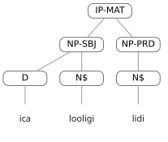

<div style="page-break-before: always;"></div>

### ped-gramm,0.15

| Field | Value |
|---|---|
| Dataset | ped-gramm |
| Status | DONE |
| Text | ica looligi lideGegi |
| Portuguese | A comida é deliciosa (a gostosura da comida dela) |
| A result | STRUCTURAL_DIFFERENCE |
| C result | EXACT_MATCH |

#### BEFORE — parser A — LISP

```lisp
(
  (IP-MAT
    (NP
      (D ica)
      (N$ looligi)
      (NP
        (N$ lideGegi))))
  (ID ped-gramm,0.15))
```

#### BEFORE — parser A — graphical tree


#### AFTER — parser C — LISP

```lisp
(
  (IP-MAT
    (NP-SBJ
      (D ica)
      (N$ looligi))
    (NP-PRD
      (N$ lideGegi)))
  (ID ped-gramm,0.15))
```

#### AFTER — parser C — graphical tree

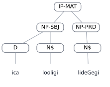

<div style="page-break-before: always;"></div>

### ped-gramm,0.16

| Field | Value |
|---|---|
| Dataset | ped-gramm |
| Status | DONE |
| Text | loigipodi libinienigipi |
| Portuguese | A comunidade dele/dela é bonita |
| A result | STRUCTURAL_DIFFERENCE |
| C result | EXACT_MATCH |

#### BEFORE — parser A — LISP

```lisp
(
  (IP-MAT
    (NP
      (N$ loigipodi)
      (NP
        (N$ libinienigipi))))
  (ID ped-gramm,0.16))
```

#### BEFORE — parser A — graphical tree


#### AFTER — parser C — LISP

```lisp
(
  (IP-MAT
    (NP-SBJ
      (N$ loigipodi))
    (NP-PRD
      (N$ libinienigipi)))
  (ID ped-gramm,0.16))
```

#### AFTER — parser C — graphical tree

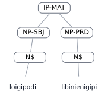

<div style="page-break-before: always;"></div>

### ped-gramm,0.17

| Field | Value |
|---|---|
| Dataset | ped-gramm |
| Status | DONE |
| Text | ica loigi ijo niganigi ipegitegi GanigotGa |
| Portuguese | A comunidade do menino é perto da cidade de vocês |
| A result | STRUCTURAL_DIFFERENCE |
| C result | EXACT_MATCH |

#### BEFORE — parser A — LISP

```lisp
(
  (IP-MAT
    (NP
      (NP
        (D ica)
        (N$ loigi))
      (D ijo)
      (N niganigi))
    (VBAPL ipegitegi)
    (NP-APL
      (N$ GanigotGa)))
  (ID ped-gramm,0.17))
```

#### BEFORE — parser A — graphical tree

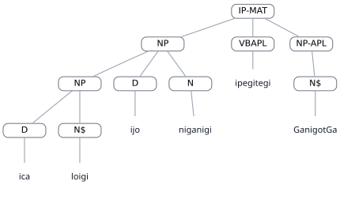

#### AFTER — parser C — LISP

```lisp
(
  (IP-MAT
    (NP
      (D ica)
      (N$ loigi)
      (NP
        (D ijo)
        (N niganigi)))
    (VBAPL ipegitegi)
    (NP-APL
      (N$ GanigotGa)))
  (ID ped-gramm,0.17))
```

#### AFTER — parser C — graphical tree

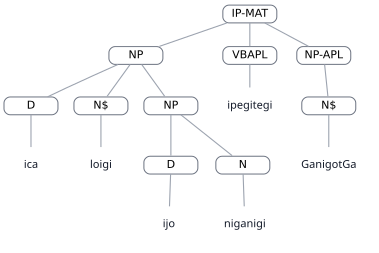

<div style="page-break-before: always;"></div>

### ped-gramm,0.19

| Field | Value |
|---|---|
| Dataset | ped-gramm |
| Status | DONE |
| Text | ica liwigo libinienigi |
| Portuguese | a fotografia dela/dele é/está bonita |
| A result | STRUCTURAL_DIFFERENCE |
| C result | EXACT_MATCH |

#### BEFORE — parser A — LISP

```lisp
(
  (IP-MAT
    (NP
      (D ica)
      (N$ liwigo)
      (NP
        (N$ libinienigi))))
  (ID ped-gramm,0.19))
```

#### BEFORE — parser A — graphical tree


#### AFTER — parser C — LISP

```lisp
(
  (IP-MAT
    (NP-SBJ
      (D ica)
      (N$ liwigo))
    (NP-PRD
      (N$ libinienigi)))
  (ID ped-gramm,0.19))
```

#### AFTER — parser C — graphical tree

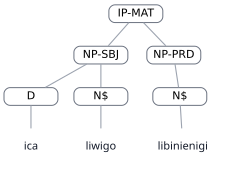

<div style="page-break-before: always;"></div>

### ped-gramm,0.20

| Field | Value |
|---|---|
| Dataset | ped-gramm |
| Status | DONE |
| Text | ica niwigo libinienigi |
| Portuguese | a fotografia é/está bonita |
| A result | STRUCTURAL_DIFFERENCE |
| C result | EXACT_MATCH |

#### BEFORE — parser A — LISP

```lisp
(
  (IP-MAT
    (NP-SBJ
      (D ica)
      (NP
        (N niwigo)))
    (NP-PRD
      (N$ libinienigi)))
  (ID ped-gramm,0.20))
```

#### BEFORE — parser A — graphical tree


#### AFTER — parser C — LISP

```lisp
(
  (IP-MAT
    (NP-SBJ
      (D ica)
      (N niwigo))
    (NP-PRD
      (N$ libinienigi)))
  (ID ped-gramm,0.20))
```

#### AFTER — parser C — graphical tree


<div style="page-break-before: always;"></div>

### van-data,0.11

| Field | Value |
|---|---|
| Dataset | van-data |
| Status | DONE |
| Text | niGida liwenigi libinienigi |
| Portuguese | aquela comida dela é bonita |
| A result | STRUCTURAL_DIFFERENCE |
| C result | EXACT_MATCH |

#### BEFORE — parser A — LISP

```lisp
(
  (IP-MAT
    (NP
      (D niGida)
      (N$ liwenigi)
      (NP
        (N$ libinienigi))))
  (ID van-data,0.11))
```

#### BEFORE — parser A — graphical tree


#### AFTER — parser C — LISP

```lisp
(
  (IP-MAT
    (NP-SBJ
      (D niGida)
      (N$ liwenigi))
    (NP-PRD
      (N$ libinienigi)))
  (ID van-data,0.11))
```

#### AFTER — parser C — graphical tree

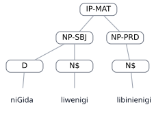

<div style="page-break-before: always;"></div>

### van-data,0.32

| Field | Value |
|---|---|
| Dataset | van-data |
| Status | DONE |
| Text | naGani wetiGa liwaGatena |
| Portuguese | esta pedra está muito pesada |
| A result | STRUCTURAL_DIFFERENCE |
| C result | EXACT_MATCH |

#### BEFORE — parser A — LISP

```lisp
(
  (IP-MAT
    (NP-SBJ
      (D naGani)
      (NP
        (N wetiGa)))
    (NP-PRD
      (N$ liwaGatena)))
  (ID van-data,0.32))
```

#### BEFORE — parser A — graphical tree


#### AFTER — parser C — LISP

```lisp
(
  (IP-MAT
    (NP-SBJ
      (D naGani)
      (N wetiGa))
    (NP-PRD
      (N$ liwaGatena)))
  (ID van-data,0.32))
```

#### AFTER — parser C — graphical tree


# 3. DONE regressions

<div style="page-break-before: always;"></div>

### hil-data,0.43

| Field | Value |
|---|---|
| Dataset | hil-data |
| Status | DONE |
| Text | niGidiwa okokodi ligetedi liwigo libinienaGa |
| Portuguese | Estes ovos da fotografia estão bonitos . |
| A result | EXACT_MATCH |
| C result | STRUCTURAL_DIFFERENCE |

#### BEFORE — parser A — LISP

```lisp
(
  (IP-MAT
    (NP-SBJ
      (D niGidiwa)
      (NP
        (N okokodi))
      (N$ ligetedi)
      (NP
        (N$ liwigo)))
    (NP-PRD
      (N$ libinienaGa)))
  (ID hil-data,0.43))
```

#### BEFORE — parser A — graphical tree

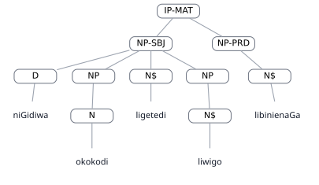

#### AFTER — parser C — LISP

```lisp
(
  (IP-MAT
    (NP-SBJ
      (NP
        (D niGidiwa)
        (NP
          (N okokodi))
        (N$ ligetedi))
      (N$ liwigo))
    (NP-PRD
      (N$ libinienaGa)))
  (ID hil-data,0.43))
```

#### AFTER — parser C — graphical tree

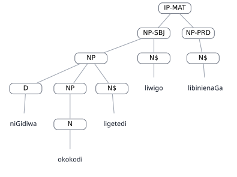

<div style="page-break-before: always;"></div>

### hil-data,0.44

| Field | Value |
|---|---|
| Dataset | hil-data |
| Status | DONE |
| Text | NiGidiwa noGojedi lixagotaGaGa adakake loojedi |
| Portuguese | Estes peixes vermelhos estão baratos . |
| A result | TRACE_EQUIVALENT |
| C result | STRUCTURAL_DIFFERENCE |

#### BEFORE — parser A — LISP

```lisp
(
  (IP-MAT
    (NP-1
      (D NiGidiwa)
      (NP
        (N noGojedi))
      (N$ lixagotaGaGa))
    (NEG aG@)
    (VBU @dakake)
    (NP
      (NP-GEN *T*-1)
      (N$ loojedi)))
  (ID hil-data,0.44))
```

#### BEFORE — parser A — graphical tree

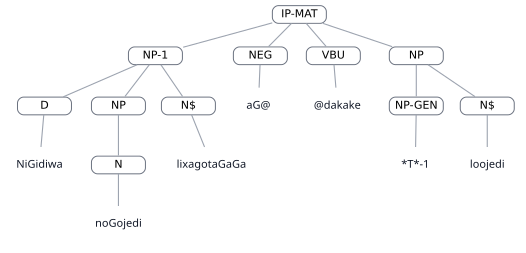

#### AFTER — parser C — LISP

```lisp
(
  (IP-MAT
    (NP-1
      (D NiGidiwa)
      (N noGojedi))
    (NP-3
      (NP-GEN *T*-1)
      (N$ lixagotaGaGa))
    (NEG aG@)
    (VBU @dakake)
    (NP
      (NP-GEN *T*-2)
      (N$ loojedi)))
  (ID hil-data,0.44))
```

#### AFTER — parser C — graphical tree

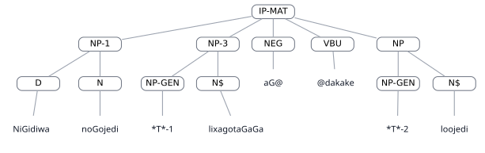

<div style="page-break-before: always;"></div>

### van-data,0.47

| Field | Value |
|---|---|
| Dataset | van-data |
| Status | DONE |
| Text | idiwa noGojedi lixagotaGaGa adakake loojedi |
| Portuguese | estes peixes vermelhos estão baratos |
| A result | TRACE_EQUIVALENT |
| C result | STRUCTURAL_DIFFERENCE |

#### BEFORE — parser A — LISP

```lisp
(
  (IP-MAT
    (NP-1
      (D idiwa)
      (NP
        (N noGojedi))
      (N$ lixagotaGaGa))
    (NEG aG@)
    (VBU @dakake)
    (NP
      (NP-GEN *T*-1)
      (N$ loojedi)))
  (ID van-data,0.47))
```

#### BEFORE — parser A — graphical tree

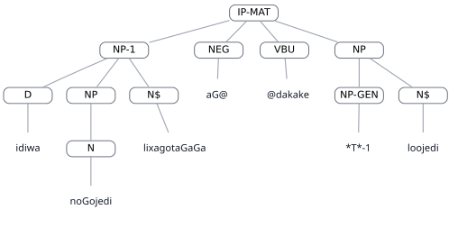

#### AFTER — parser C — LISP

```lisp
(
  (IP-MAT
    (NP-1
      (D idiwa)
      (N noGojedi))
    (NP-3
      (NP-GEN *T*-1)
      (N$ lixagotaGaGa))
    (NEG aG@)
    (VBU @dakake)
    (NP
      (NP-GEN *T*-2)
      (N$ loojedi)))
  (ID van-data,0.47))
```

#### AFTER — parser C — graphical tree

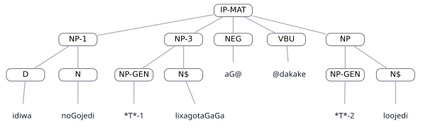

# 4. DONE persistent structural cases

In these cases, both parsers remain structurally different from the gold tree. The A and C outputs may nevertheless be identical to or different from one another.

<div style="page-break-before: always;"></div>

### ped-gramm,0.11

| Field | Value |
|---|---|
| Dataset | ped-gramm |
| Status | DONE |
| Text | ica Maria looligi alidi |
| Portuguese | a comida da Maria não está deliciosa (a não gostosura da comida da Maria) |
| A result | STRUCTURAL_DIFFERENCE |
| C result | STRUCTURAL_DIFFERENCE |

#### REFERENCE — GOLD — LISP

```lisp
(
  (IP-MAT
    (NP-SBJ
      (NP
        (D ica)
        (NPR Maria))
      (N$ looligi))
    (NEG aG@)
    (NP-PRD
      (N$ @lidi)))
  (ID ped-gramm,0.11))
```

#### REFERENCE — GOLD — graphical tree

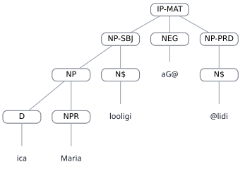

#### BEFORE — parser A — LISP

```lisp
(
  (IP-MAT
    (NP-SBJ
      (D ica)
      (NPR Maria)
      (N$ looligi))
    (NEG aG@)
    (NP-PRD
      (N$ @lidi)))
  (ID ped-gramm,0.11))
```

#### BEFORE — parser A — graphical tree

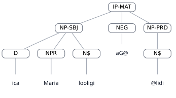

#### AFTER — parser C — LISP

```lisp
(
  (IP-MAT
    (NP-SBJ
      (D ica)
      (NPR Maria))
    (NP-SBJ-PRD
      (N$ looligi))
    (NEG aG@)
    (NP-PRD
      (N$ @lidi)))
  (ID ped-gramm,0.11))
```

#### AFTER — parser C — graphical tree

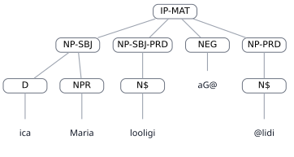

<div style="page-break-before: always;"></div>

### ped-gramm,0.26

| Field | Value |
|---|---|
| Dataset | ped-gramm |
| Status | DONE |
| Text | João liGeladi ane napioi |
| Portuguese | a casa do João, que é suja |
| A result | STRUCTURAL_DIFFERENCE |
| C result | STRUCTURAL_DIFFERENCE |

#### REFERENCE — GOLD — LISP

```lisp
(
  (IP-MAT
    (NP
      (NP
        (NPR João))
      (N$ liGeladi)
      (CP-REL
        (WNP-1
          (WPRO ane))
        (IP-SUB
          (NP-TRACE
            (-NONE- *T*-1))
          (NP
            (N napioi))))))
  (ID ped-gramm,0.26))
```

#### REFERENCE — GOLD — graphical tree

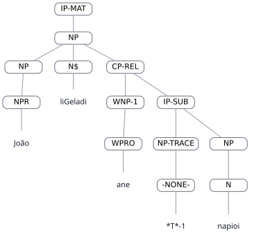

#### BEFORE — parser A — LISP

```lisp
(
  (IP-MAT
    (NP
      (NPR João)
      (N$ liGeladi)
      (CP-REL
        (WNP-1
          (WPRO ane))
        (IP-SUB
          (NP-TRACE *T*-1)
          (NP
            (N napioi))))))
  (ID ped-gramm,0.26))
```

#### BEFORE — parser A — graphical tree

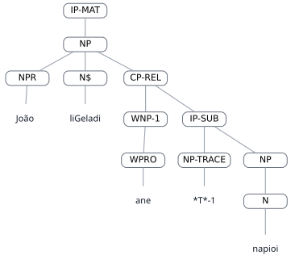

#### AFTER — parser C — LISP

```lisp
(
  (IP-MAT
    (NP-SBJ
      (NPR João))
    (NP-PRD
      (N$ liGeladi)
      (CP-REL
        (WNP-1
          (WPRO ane))
        (IP-SUB
          (NP-TRACE *T*-1)
          (NP
            (N napioi))))))
  (ID ped-gramm,0.26))
```

#### AFTER — parser C — graphical tree

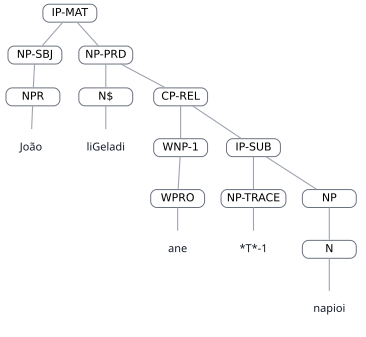

<div style="page-break-before: always;"></div>

### ped-gramm,0.40

| Field | Value |
|---|---|
| Dataset | ped-gramm |
| Status | DONE |
| Text | iGeladi digoida weiigi . |
| Portuguese | Minha casa é no rio. |
| A result | STRUCTURAL_DIFFERENCE |
| C result | STRUCTURAL_DIFFERENCE |

#### REFERENCE — GOLD — LISP

```lisp
(
  (IP-MAT
    (NP-SBJ
      (N$ iGeladi))
    (NP-PRD
      (D digoida)
      (N weiigi))
    (PUNC .))
  (ID ped-gramm,0.40))
```

#### REFERENCE — GOLD — graphical tree

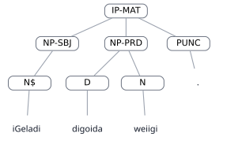

#### BEFORE — parser A — LISP

```lisp
(
  (IP-MAT
    (NP
      (NP
        (N$ iGeladi))
      (D digoida)
      (N weiigi))
    (PUNC .))
  (ID ped-gramm,0.40))
```

#### BEFORE — parser A — graphical tree


#### AFTER — parser C — LISP

```lisp
(
  (IP-MAT
    (NP
      (N$ iGeladi)
      (NP
        (D digoida)
        (N weiigi)))
    (PUNC .))
  (ID ped-gramm,0.40))
```

#### AFTER — parser C — graphical tree

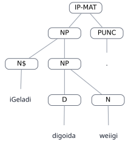

<div style="page-break-before: always;"></div>

### ped-gramm,0.47

| Field | Value |
|---|---|
| Dataset | ped-gramm |
| Status | DONE |
| Text | liGeladi ipegitege niweiigi nigotaGa . |
| Portuguese | A casa dele/dela é perto da cidade da lagoa. |
| A result | STRUCTURAL_DIFFERENCE |
| C result | STRUCTURAL_DIFFERENCE |

#### REFERENCE — GOLD — LISP

```lisp
(
  (IP-MAT
    (NP
      (N$ liGeladi))
    (VBAPL ipegitege)
    (NP-APL
      (NP
        (N niweiigi))
      (N$ nigotaGa))
    (PUNC .))
  (ID ped-gramm,0.47))
```

#### REFERENCE — GOLD — graphical tree


#### BEFORE — parser A — LISP

```lisp
(
  (IP-MAT
    (NP
      (N$ liGeladi))
    (VBAPL ipegitege)
    (NP-APL
      (N niweiigi)
      (N$ nigotaGa))
    (PUNC .))
  (ID ped-gramm,0.47))
```

#### BEFORE — parser A — graphical tree


#### AFTER — parser C — LISP

```lisp
(
  (IP-MAT
    (NP
      (N$ liGeladi))
    (VBAPL ipegitege)
    (NP-APL
      (N niweiigi))
    (NP
      (N$ nigotaGa))
    (PUNC .))
  (ID ped-gramm,0.47))
```

#### AFTER — parser C — graphical tree

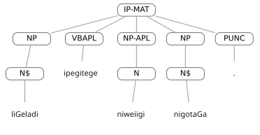

<div style="page-break-before: always;"></div>

### van-data,0.1

| Field | Value |
|---|---|
| Dataset | van-data |
| Status | DONE |
| Text | iGeladi digoida weiigi |
| Portuguese | Minha casa é no rio |
| A result | STRUCTURAL_DIFFERENCE |
| C result | STRUCTURAL_DIFFERENCE |

#### REFERENCE — GOLD — LISP

```lisp
(
  (IP-MAT
    (NP-SBJ
      (N$ iGeladi))
    (NP-PRD
      (D digoida)
      (N weiigi)))
  (ID van-data,0.1))
```

#### REFERENCE — GOLD — graphical tree

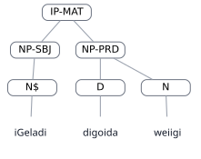

#### BEFORE — parser A — LISP

```lisp
(
  (IP-MAT
    (NP
      (NP
        (N$ iGeladi))
      (D digoida)
      (N weiigi)))
  (ID van-data,0.1))
```

#### BEFORE — parser A — graphical tree


#### AFTER — parser C — LISP

```lisp
(
  (IP-MAT
    (NP
      (N$ iGeladi)
      (NP
        (D digoida)
        (N weiigi))))
  (ID van-data,0.1))
```

#### AFTER — parser C — graphical tree

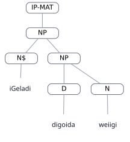

<div style="page-break-before: always;"></div>

### van-data,0.30

| Field | Value |
|---|---|
| Dataset | van-data |
| Status | DONE |
| Text | niGijo lodaajo ajo lodowa aGica digoida liGeladi |
| Portuguese | esta faca da esposa dele não está na casa |
| A result | STRUCTURAL_DIFFERENCE |
| C result | STRUCTURAL_DIFFERENCE |

#### REFERENCE — GOLD — LISP

```lisp
(
  (IP-MAT
    (NP-SBJ
      (D niGijo)
      (N$ lodaajo)
      (NP
        (D ajo)
        (N$ lodowa)))
    (NEG aG@)
    (NP-PRD
      (Q @ica)
      (D digoida)
      (N$ liGeladi)))
  (ID van-data,0.30))
```

#### REFERENCE — GOLD — graphical tree

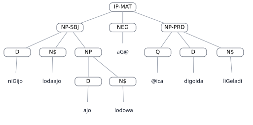

#### BEFORE — parser A — LISP

```lisp
(
  (IP-MAT
    (NP-SBJ
      (NP
        (D niGijo)
        (N$ lodaajo))
      (D ajo)
      (N$ lodowa))
    (NEG aG@)
    (NP-PRD
      (Q @ica)
      (D digoida)
      (N$ liGeladi)))
  (ID van-data,0.30))
```

#### BEFORE — parser A — graphical tree

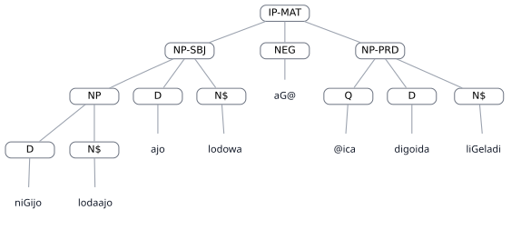

#### AFTER — parser C — LISP

```lisp
(
  (IP-MAT
    (NP-SBJ
      (D niGijo)
      (N$ lodaajo))
    (NP-SBJ-PRD
      (D ajo)
      (N$ lodowa))
    (NEG aG@)
    (NP-PRD
      (Q @ica)
      (D digoida)
      (N$ liGeladi)))
  (ID van-data,0.30))
```

#### AFTER — parser C — graphical tree

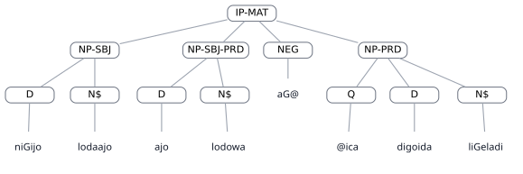

<div style="page-break-before: always;"></div>

### van-data,0.37

| Field | Value |
|---|---|
| Dataset | van-data |
| Status | DONE |
| Text | ani wetiGa me iwaGadi eniteloco iGonagi |
| Portuguese | esta pedra que é pesada caiu no meu pé |
| A result | STRUCTURAL_DIFFERENCE |
| C result | STRUCTURAL_DIFFERENCE |

#### REFERENCE — GOLD — LISP

```lisp
(
  (IP-MAT
    (NP
      (D ani)
      (N wetiGa)
      (CP-me
        (C me)
        (IP-SUB
          (VB iwaGadi))))
    (VBAPL eniteloco)
    (NP-APL
      (N$ iGonagi)))
  (ID van-data,0.37))
```

#### REFERENCE — GOLD — graphical tree

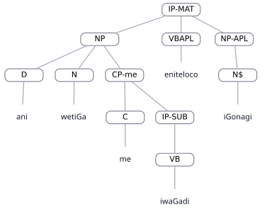

#### BEFORE — parser A — LISP

```lisp
(
  (IP-MAT
    (NP
      (D ani)
      (N wetiGa))
    (CP-me
      (C me)
      (IP-SUB
        (VB iwaGadi)))
    (VBAPL eniteloco)
    (NP-APL
      (N$ iGonagi)))
  (ID van-data,0.37))
```

#### BEFORE — parser A — graphical tree


#### AFTER — parser C — LISP

```lisp
(
  (IP-MAT
    (NP
      (D ani)
      (N wetiGa))
    (CP-me
      (C me)
      (IP-SUB
        (VB iwaGadi)))
    (VBAPL eniteloco)
    (NP-APL
      (N$ iGonagi)))
  (ID van-data,0.37))
```

#### AFTER — parser C — graphical tree

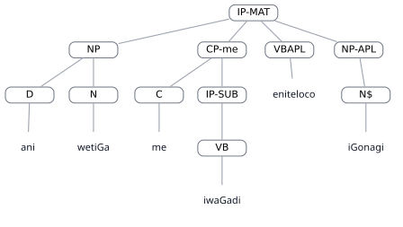

<div style="page-break-before: always;"></div>

### van-data,0.43

| Field | Value |
|---|---|
| Dataset | van-data |
| Status | DONE |
| Text | ijo niwigo libinienigi ijowa nigetedi |
| Portuguese | estes ovos da fotografia dela estão bonitos |
| A result | STRUCTURAL_DIFFERENCE |
| C result | STRUCTURAL_DIFFERENCE |

#### REFERENCE — GOLD — LISP

```lisp
(
  (IP-MAT
    (NP-SBJ
      (D ijo)
      (NP
        (N niwigo))
      (N$ libinienigi))
    (NP-PRD
      (D ijowa)
      (N$ nigetedi)))
  (ID van-data,0.43))
```

#### REFERENCE — GOLD — graphical tree


#### BEFORE — parser A — LISP

```lisp
(
  (IP-MAT
    (NP-SBJ
      (NP
        (D ijo)
        (NP
          (N niwigo))
        (N$ libinienigi))
      (D ijowa))
    (NP-PRD
      (N$ nigetedi)))
  (ID van-data,0.43))
```

#### BEFORE — parser A — graphical tree

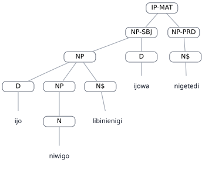

#### AFTER — parser C — LISP

```lisp
(
  (IP-MAT
    (NP-SBJ
      (D ijo)
      (N niwigo))
    (NP-SBJ-PRD
      (N$ libinienigi))
    (NP-PRD
      (D ijowa)
      (N$ nigetedi)))
  (ID van-data,0.43))
```

#### AFTER — parser C — graphical tree

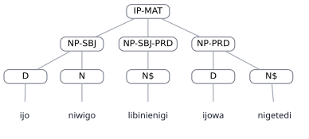

<div style="page-break-before: always;"></div>

### van-data,0.44

| Field | Value |
|---|---|
| Dataset | van-data |
| Status | DONE |
| Text | ijoa nigetedi niwigo libinienigipi |
| Portuguese | estes ovos da fotografia estão bonitos |
| A result | STRUCTURAL_DIFFERENCE |
| C result | STRUCTURAL_DIFFERENCE |

#### REFERENCE — GOLD — LISP

```lisp
(
  (IP-MAT
    (NP-SBJ
      (D ijoa)
      (N nigetedi)
      (NP
        (N niwigo)))
    (NP-PRD
      (N$ libinienigipi)))
  (ID van-data,0.44))
```

#### REFERENCE — GOLD — graphical tree

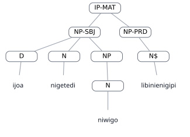

#### BEFORE — parser A — LISP

```lisp
(
  (IP-MAT
    (NP-SBJ
      (D ijoa)
      (N nigetedi))
    (NP-PRD
      (N niwigo)
      (N$ libinienigipi)))
  (ID van-data,0.44))
```

#### BEFORE — parser A — graphical tree

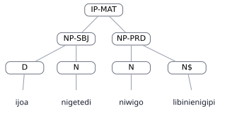

#### AFTER — parser C — LISP

```lisp
(
  (IP-MAT
    (NP-SBJ
      (D ijoa)
      (N nigetedi))
    (NP-SBJ-PRD
      (N niwigo))
    (NP-PRD
      (N$ libinienigipi)))
  (ID van-data,0.44))
```

#### AFTER — parser C — graphical tree

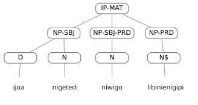

<div style="page-break-before: always;"></div>

### van-data,0.72

| Field | Value |
|---|---|
| Dataset | van-data |
| Status | DONE |
| Text | ijowa leonigipi iwaalo idi metaGa |
| Portuguese | os filhos da mulher estão com ele |
| A result | STRUCTURAL_DIFFERENCE |
| C result | STRUCTURAL_DIFFERENCE |

#### REFERENCE — GOLD — LISP

```lisp
(
  (IP-MAT
    (NP
      (D ijowa)
      (N$ leonigipi)
      (NP
        (N iwaalo)))
    (CP
      (NP
        (D idi))
      (CAPL metaGa)))
  (ID van-data,0.72))
```

#### REFERENCE — GOLD — graphical tree


#### BEFORE — parser A — LISP

```lisp
(
  (IP-MAT
    (NP-SBJ
      (D ijowa)
      (N$ leonigipi)
      (NP
        (N iwaalo)))
    (CP-me
      (IP-SUB
        (NP
          (D idi)))
      (CAPL metaGa)))
  (ID van-data,0.72))
```

#### BEFORE — parser A — graphical tree

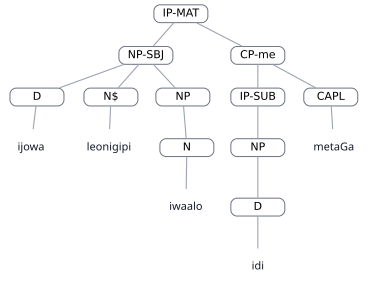

#### AFTER — parser C — LISP

```lisp
(
  (IP-MAT
    (NP-SBJ
      (D ijowa)
      (N$ leonigipi)
      (NP
        (N iwaalo)))
    (NP-PRD
      (D idi))
    (CAPL metaGa))
  (ID van-data,0.72))
```

#### AFTER — parser C — graphical tree

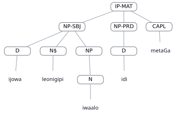

<div style="page-break-before: always;"></div>

### van-data,0.73

| Field | Value |
|---|---|
| Dataset | van-data |
| Status | DONE |
| Text | ligeladi ipegitege niweiigi nigotaGa |
| Portuguese | a casa dela é perto da cidade do rio |
| A result | STRUCTURAL_DIFFERENCE |
| C result | STRUCTURAL_DIFFERENCE |

#### REFERENCE — GOLD — LISP

```lisp
(
  (IP-MAT
    (NP
      (N$ ligeladi))
    (VBAPL ipegitege)
    (NP-APL
      (NP
        (N niweiigi))
      (N$ nigotaGa)))
  (ID van-data,0.73))
```

#### REFERENCE — GOLD — graphical tree

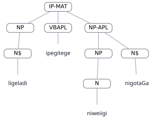

#### BEFORE — parser A — LISP

```lisp
(
  (IP-MAT
    (NP
      (N$ ligeladi))
    (VBAPL ipegitege)
    (NP-APL
      (N niweiigi)
      (N$ nigotaGa)))
  (ID van-data,0.73))
```

#### BEFORE — parser A — graphical tree


#### AFTER — parser C — LISP

```lisp
(
  (IP-MAT
    (NP
      (N$ ligeladi))
    (VBAPL ipegitege)
    (NP-APL
      (N niweiigi))
    (NP
      (N$ nigotaGa)))
  (ID van-data,0.73))
```

#### AFTER — parser C — graphical tree

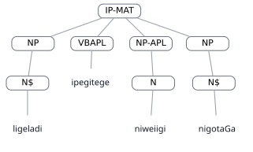
