# 1. Introduction

This document compares parser A (BEFORE) with parser C (AFTER) for DONE sentences whose classification changed. It contains every improvement and regression recorded in the transition TSV, with both parser trees shown in LISP and graphical formats for human inspection.

**DONE improvements:** 5.  
**DONE regressions:** 9.

# 2. DONE improvements

<div style="page-break-before: always;"></div>

### ped-gramm,0.40

| Field | Value |
|---|---|
| Dataset | ped-gramm |
| Status | DONE |
| Text | iGeladi digoida weiigi . |
| Portuguese | Minha casa é no rio. |
| A result | STRUCTURAL_DIFFERENCE |
| C result | EXACT_MATCH |

#### BEFORE — parser A — LISP

```lisp
(
  (IP-MAT
    (NP
      (NP
        (N$ iGeladi))
      (D digoida)
      (N weiigi))
    (PUNC .))
  (ID ped-gramm,0.40))
```

#### BEFORE — parser A — graphical tree

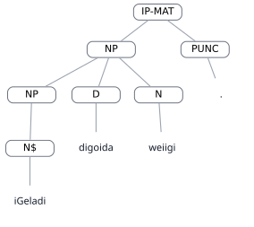

#### AFTER — parser C — LISP

```lisp
(
  (IP-MAT
    (NP-SBJ
      (N$ iGeladi))
    (NP-PRD
      (D digoida)
      (N weiigi))
    (PUNC .))
  (ID ped-gramm,0.40))
```

#### AFTER — parser C — graphical tree


<div style="page-break-before: always;"></div>

### ped-gramm,0.47

| Field | Value |
|---|---|
| Dataset | ped-gramm |
| Status | DONE |
| Text | liGeladi ipegitege niweiigi nigotaGa . |
| Portuguese | A casa dele/dela é perto da cidade da lagoa. |
| A result | STRUCTURAL_DIFFERENCE |
| C result | EXACT_MATCH |

#### BEFORE — parser A — LISP

```lisp
(
  (IP-MAT
    (NP
      (N$ liGeladi))
    (VBAPL ipegitege)
    (NP-APL
      (N niweiigi)
      (N$ nigotaGa))
    (PUNC .))
  (ID ped-gramm,0.47))
```

#### BEFORE — parser A — graphical tree

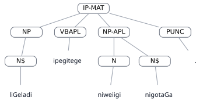

#### AFTER — parser C — LISP

```lisp
(
  (IP-MAT
    (NP
      (N$ liGeladi))
    (VBAPL ipegitege)
    (NP-APL
      (NP
        (N niweiigi))
      (N$ nigotaGa))
    (PUNC .))
  (ID ped-gramm,0.47))
```

#### AFTER — parser C — graphical tree

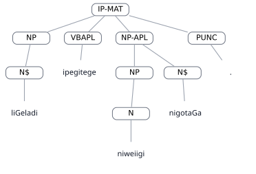

<div style="page-break-before: always;"></div>

### van-data,0.1

| Field | Value |
|---|---|
| Dataset | van-data |
| Status | DONE |
| Text | iGeladi digoida weiigi |
| Portuguese | Minha casa é no rio |
| A result | STRUCTURAL_DIFFERENCE |
| C result | EXACT_MATCH |

#### BEFORE — parser A — LISP

```lisp
(
  (IP-MAT
    (NP
      (NP
        (N$ iGeladi))
      (D digoida)
      (N weiigi)))
  (ID van-data,0.1))
```

#### BEFORE — parser A — graphical tree

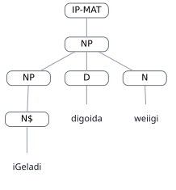

#### AFTER — parser C — LISP

```lisp
(
  (IP-MAT
    (NP-SBJ
      (N$ iGeladi))
    (NP-PRD
      (D digoida)
      (N weiigi)))
  (ID van-data,0.1))
```

#### AFTER — parser C — graphical tree


<div style="page-break-before: always;"></div>

### van-data,0.43

| Field | Value |
|---|---|
| Dataset | van-data |
| Status | DONE |
| Text | ijo niwigo libinienigi ijowa nigetedi |
| Portuguese | estes ovos da fotografia dela estão bonitos |
| A result | STRUCTURAL_DIFFERENCE |
| C result | EXACT_MATCH |

#### BEFORE — parser A — LISP

```lisp
(
  (IP-MAT
    (NP-SBJ
      (NP
        (D ijo)
        (NP
          (N niwigo))
        (N$ libinienigi))
      (D ijowa))
    (NP-PRD
      (N$ nigetedi)))
  (ID van-data,0.43))
```

#### BEFORE — parser A — graphical tree


#### AFTER — parser C — LISP

```lisp
(
  (IP-MAT
    (NP-SBJ
      (D ijo)
      (NP
        (N niwigo))
      (N$ libinienigi))
    (NP-PRD
      (D ijowa)
      (N$ nigetedi)))
  (ID van-data,0.43))
```

#### AFTER — parser C — graphical tree

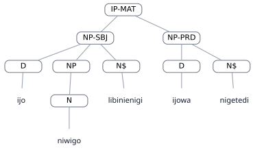

<div style="page-break-before: always;"></div>

### van-data,0.73

| Field | Value |
|---|---|
| Dataset | van-data |
| Status | DONE |
| Text | ligeladi ipegitege niweiigi nigotaGa |
| Portuguese | a casa dela é perto da cidade do rio |
| A result | STRUCTURAL_DIFFERENCE |
| C result | EXACT_MATCH |

#### BEFORE — parser A — LISP

```lisp
(
  (IP-MAT
    (NP
      (N$ ligeladi))
    (VBAPL ipegitege)
    (NP-APL
      (N niweiigi)
      (N$ nigotaGa)))
  (ID van-data,0.73))
```

#### BEFORE — parser A — graphical tree

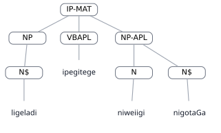

#### AFTER — parser C — LISP

```lisp
(
  (IP-MAT
    (NP
      (N$ ligeladi))
    (VBAPL ipegitege)
    (NP-APL
      (NP
        (N niweiigi))
      (N$ nigotaGa)))
  (ID van-data,0.73))
```

#### AFTER — parser C — graphical tree


# 3. DONE regressions

<div style="page-break-before: always;"></div>

### hil-data,0.11

| Field | Value |
|---|---|
| Dataset | hil-data |
| Status | DONE |
| Text | NaGajo lomigo niganigawanigi madi niwatece |
| Portuguese | Aquele anzol do menino é na canoa . |
| A result | EXACT_MATCH |
| C result | STRUCTURAL_DIFFERENCE |

#### BEFORE — parser A — LISP

```lisp
(
  (IP-MAT
    (NP-SBJ
      (D NaGajo)
      (N$ lomigo)
      (NP
        (N niganigawanigi)))
    (CP-me
      (C me@)
      (IP-SUB
        (NP
          (D @adi)
          (N$ niwatece)))))
  (ID hil-data,0.11))
```

#### BEFORE — parser A — graphical tree

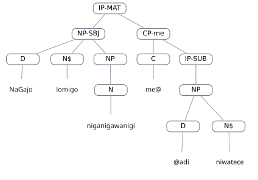

#### AFTER — parser C — LISP

```lisp
(
  (IP-MAT
    (NP
      (D NaGajo)
      (N$ lomigo)
      (NP
        (N niganigawanigi)))
    (CP
      (CP-me
        (C me@)
        (IP-SUB
          (NP
            (D @adi)
            (N$ niwatece))))))
  (ID hil-data,0.11))
```

#### AFTER — parser C — graphical tree

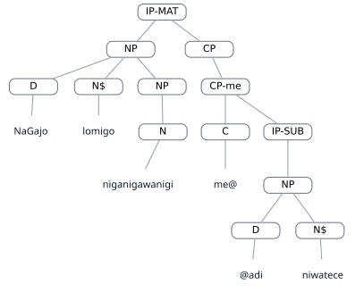

<div style="page-break-before: always;"></div>

### hil-data,0.7

| Field | Value |
|---|---|
| Dataset | hil-data |
| Status | DONE |
| Text | Gawenigi eliodi me libinienigi |
| Portuguese | A sua comida é muito bonita . |
| A result | EXACT_MATCH |
| C result | STRUCTURAL_DIFFERENCE |

#### BEFORE — parser A — LISP

```lisp
(
  (IP-MAT
    (NP-SBJ
      (N$ Gawenigi))
    (CP-me
      (Q eliodi)
      (C me)
      (IP-SUB
        (NP
          (N$ libinienigi)))))
  (ID hil-data,0.7))
```

#### BEFORE — parser A — graphical tree

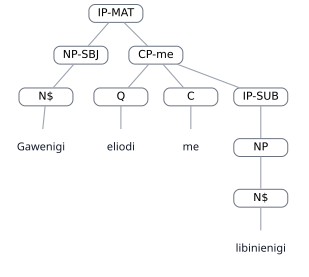

#### AFTER — parser C — LISP

```lisp
(
  (IP-MAT
    (NP
      (N$ Gawenigi))
    (CP
      (CP-me
        (Q eliodi)
        (C me)
        (IP-SUB
          (NP
            (N$ libinienigi))))))
  (ID hil-data,0.7))
```

#### AFTER — parser C — graphical tree

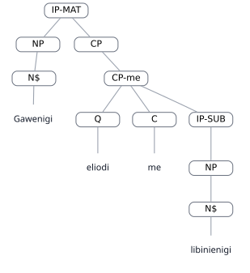

<div style="page-break-before: always;"></div>

### ped-gramm,0.35

| Field | Value |
|---|---|
| Dataset | ped-gramm |
| Status | DONE |
| Text | iGeladi ipegitegi naigi ane napioi |
| Portuguese | Minha casa está perto desta rua suja (que está suja) |
| A result | TRACE_EQUIVALENT |
| C result | STRUCTURAL_DIFFERENCE |

#### BEFORE — parser A — LISP

```lisp
(
  (IP-MAT
    (NP
      (N$ iGeladi))
    (VBAPL ipegitegi)
    (NP-APL
      (N naigi)
      (CP-REL
        (WNP-1
          (WPRO ane))
        (IP-SUB
          (NP-TRACE *T*-1)
          (NP
            (N napioi))))))
  (ID ped-gramm,0.35))
```

#### BEFORE — parser A — graphical tree

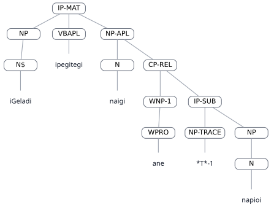

#### AFTER — parser C — LISP

```lisp
(
  (IP-MAT
    (NP
      (N$ iGeladi))
    (VBAPL ipegitegi)
    (NP-APL
      (N naigi))
    (NP
      (CP-FRL
        (WNP-1
          (WPRO ane))
        (IP-SUB
          (NP-TRACE *T*-1)
          (NP
            (N napioi))))))
  (ID ped-gramm,0.35))
```

#### AFTER — parser C — graphical tree

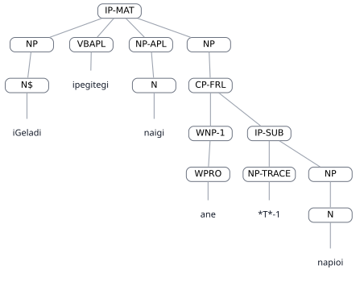

<div style="page-break-before: always;"></div>

### ped-gramm,0.56

| Field | Value |
|---|---|
| Dataset | ped-gramm |
| Status | DONE |
| Text | IiGeladi midi akiidi |
| Portuguese | A casa dele/dela é no rio. |
| A result | EXACT_MATCH |
| C result | STRUCTURAL_DIFFERENCE |

#### BEFORE — parser A — LISP

```lisp
(
  (IP-MAT
    (NP-SBJ
      (N$ IiGeladi))
    (CP-me
      (C me@)
      (IP-SUB
        (NP
          (D @idi)
          (N akiidi)))))
  (ID ped-gramm,0.56))
```

#### BEFORE — parser A — graphical tree

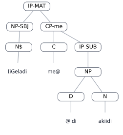

#### AFTER — parser C — LISP

```lisp
(
  (IP-MAT
    (NP
      (N$ IiGeladi))
    (CP
      (CP-me
        (C me@)
        (IP-SUB
          (NP
            (D @idi)
            (N akiidi))))))
  (ID ped-gramm,0.56))
```

#### AFTER — parser C — graphical tree

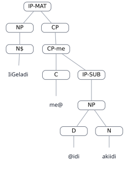

<div style="page-break-before: always;"></div>

### van-data,0.10

| Field | Value |
|---|---|
| Dataset | van-data |
| Status | DONE |
| Text | Gawenigi eliodi me libinienigi |
| Portuguese | a sua comida é muito bonita |
| A result | EXACT_MATCH |
| C result | STRUCTURAL_DIFFERENCE |

#### BEFORE — parser A — LISP

```lisp
(
  (IP-MAT
    (NP-SBJ
      (N$ Gawenigi))
    (CP-me
      (Q eliodi)
      (C me)
      (IP-SUB
        (NP
          (N$ libinienigi)))))
  (ID van-data,0.10))
```

#### BEFORE — parser A — graphical tree


#### AFTER — parser C — LISP

```lisp
(
  (IP-MAT
    (NP
      (N$ Gawenigi))
    (CP
      (CP-me
        (Q eliodi)
        (C me)
        (IP-SUB
          (NP
            (N$ libinienigi))))))
  (ID van-data,0.10))
```

#### AFTER — parser C — graphical tree


<div style="page-break-before: always;"></div>

### van-data,0.14

| Field | Value |
|---|---|
| Dataset | van-data |
| Status | DONE |
| Text | naGajo lomiigo nigaanigawaanigi manitaGa niwatece |
| Portuguese | Aquele anzol do menino está na canoa. |
| A result | EXACT_MATCH |
| C result | STRUCTURAL_DIFFERENCE |

#### BEFORE — parser A — LISP

```lisp
(
  (IP-MAT
    (NP-SBJ
      (D naGajo)
      (N$ lomiigo)
      (NP
        (N nigaanigawaanigi)))
    (CP-me
      (C me@)
      (IP-SUB
        (NP
          (DAPL @anitaGa)
          (N niwatece)))))
  (ID van-data,0.14))
```

#### BEFORE — parser A — graphical tree

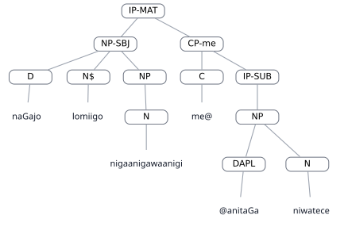

#### AFTER — parser C — LISP

```lisp
(
  (IP-MAT
    (NP
      (D naGajo)
      (N$ lomiigo)
      (NP
        (N nigaanigawaanigi)))
    (CP
      (CP-me
        (C me@)
        (IP-SUB
          (NP
            (DAPL @anitaGa)
            (N niwatece))))))
  (ID van-data,0.14))
```

#### AFTER — parser C — graphical tree

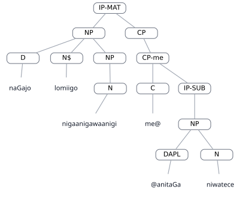

<div style="page-break-before: always;"></div>

### van-data,0.18

| Field | Value |
|---|---|
| Dataset | van-data |
| Status | DONE |
| Text | Eyo manitaGa nigotaGa |
| Portuguese | Estou na cidade |
| A result | EXACT_MATCH |
| C result | STRUCTURAL_DIFFERENCE |

#### BEFORE — parser A — LISP

```lisp
(
  (IP-MAT
    (NP-SBJ
      (PRO Eyo))
    (CP-me
      (C me@)
      (IP-SUB
        (NP
          (DAPL @anitaGa)
          (N nigotaGa)))))
  (ID van-data,0.18))
```

#### BEFORE — parser A — graphical tree

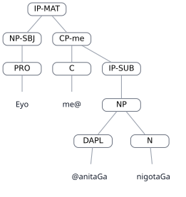

#### AFTER — parser C — LISP

```lisp
(
  (IP-MAT
    (NP
      (PRO Eyo))
    (CP
      (CP-me
        (C me@)
        (IP-SUB
          (NP
            (DAPL @anitaGa)
            (N nigotaGa))))))
  (ID van-data,0.18))
```

#### AFTER — parser C — graphical tree

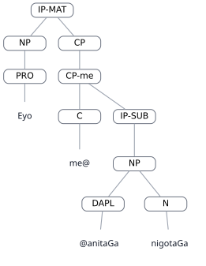

<div style="page-break-before: always;"></div>

### van-data,0.61

| Field | Value |
|---|---|
| Dataset | van-data |
| Status | DONE |
| Text | aGeewi mica iniKGigi |
| Portuguese | não sou muito feliz (não é verdade que eu sou feliz) |
| A result | EXACT_MATCH |
| C result | STRUCTURAL_DIFFERENCE |

#### BEFORE — parser A — LISP

```lisp
(
  (IP-MAT
    (NEG aG@)
    (NP
      (PRO @ee))
    (ADJ @ewi)
    (CP-me
      (C me@)
      (IP-SUB
        (NP
          (D @ica)
          (N$ iniKGigi)))))
  (ID van-data,0.61))
```

#### BEFORE — parser A — graphical tree

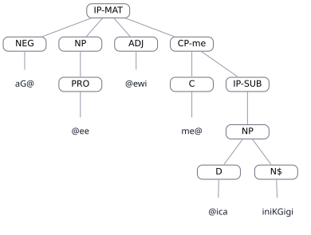

#### AFTER — parser C — LISP

```lisp
(
  (IP-MAT
    (NEG aG@)
    (NP
      (PRO @ee))
    (ADJ @ewi)
    (CP
      (CP-me
        (C me@)
        (IP-SUB
          (NP
            (D @ica)
            (N$ iniKGigi))))))
  (ID van-data,0.61))
```

#### AFTER — parser C — graphical tree

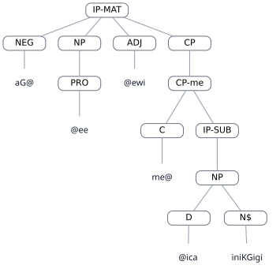

<div style="page-break-before: always;"></div>

### van-data,0.62

| Field | Value |
|---|---|
| Dataset | van-data |
| Status | DONE |
| Text | aGeyo mica inikGigi |
| Portuguese | não sou muito feliz |
| A result | EXACT_MATCH |
| C result | STRUCTURAL_DIFFERENCE |

#### BEFORE — parser A — LISP

```lisp
(
  (IP-MAT
    (NEG aG@)
    (NP-SBJ
      (PRO @eyo))
    (CP-me
      (C me@)
      (IP-SUB
        (NP
          (D @ica)
          (N$ inikGigi)))))
  (ID van-data,0.62))
```

#### BEFORE — parser A — graphical tree

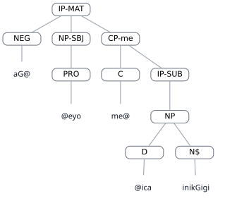

#### AFTER — parser C — LISP

```lisp
(
  (IP-MAT
    (NEG aG@)
    (NP
      (PRO @eyo))
    (CP
      (CP-me
        (C me@)
        (IP-SUB
          (NP
            (D @ica)
            (N$ inikGigi))))))
  (ID van-data,0.62))
```

#### AFTER — parser C — graphical tree

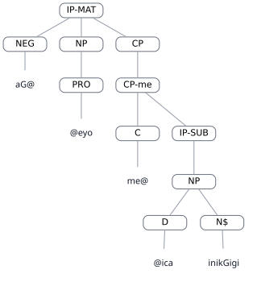
